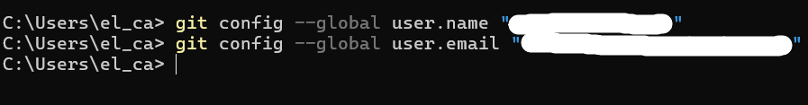
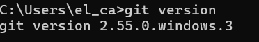
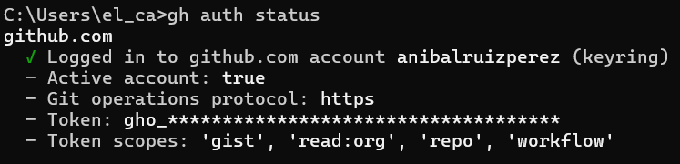
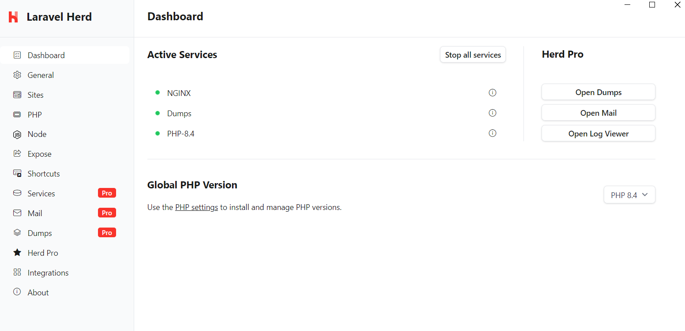
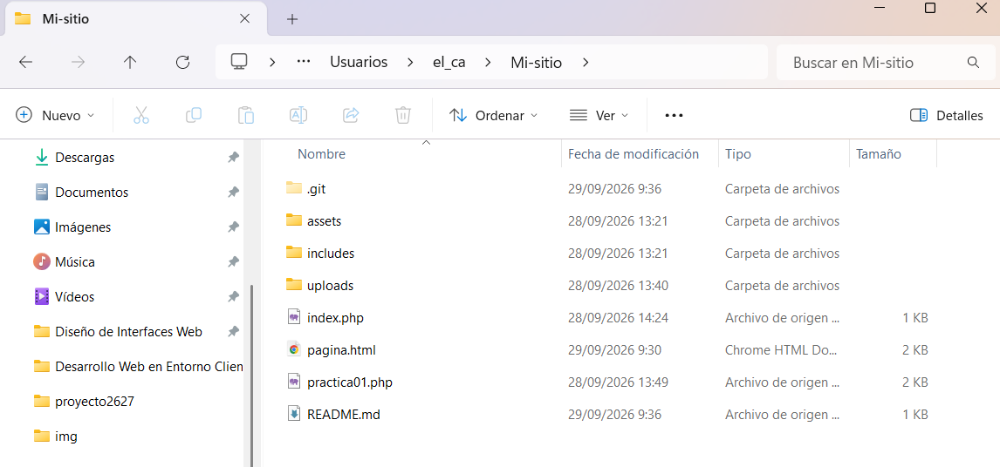
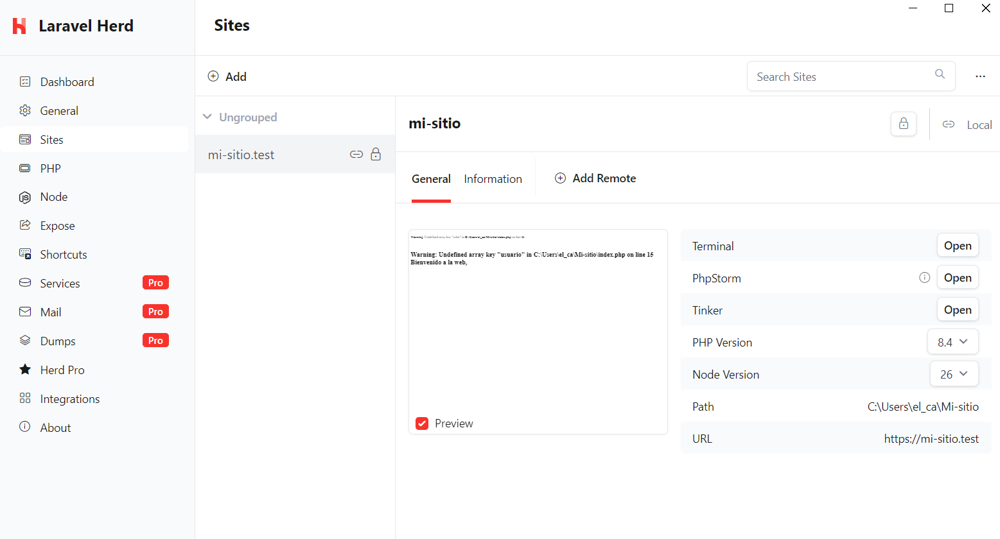
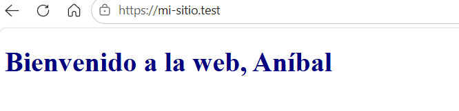

# PRÁCTICA 01: DOCUMENTACIÓN DEL PROYECTO MI_SITIO CON HERD

---

- Git instalado y configurado en local

- GitHub CLI instalado y configurado (gh auth status).

- Herd instalado con la versión de PHP 8.4.

- repositorio "misitio" clonado en local

- Herd enlazado al repositorio "misitio" y sirviéndolo en  HTTPS.

## 1. Validación de la instalación del entorno de desarrollo

### Git instalado y configurado en local

### GitHub CLI instalado y configurado

### Herd instalado con la versión de PHP 8.4

### Repositorio "Mi_sitio" clonado en local

### Herd enlazado al repositorio "Mi_sitio" y sirviéndolo en HTTPS

Como apartado final, hay que redactar un resumen de los elementos y plugin de "ReadtheDocs" usados. 

## 2. Elementos, plugins y extensiones usadas

### Temas
- Tema ReadtheDocs

### Extensiones de Markdown
  - tables
  - codehilite
  - pymdownx.superfences
  - pymdownx.betterem
  - pymdownx.caret
  - pymdownx.details
  - pymdownx.emoji
  - pymdownx.mark
  - pymdownx.superfences
  - pymdownx.tasklist
  - pymdownx.tilde
  - pymdownx.arithmatex
  - pymdownx.blocks.admonition
  - pymdownx.magiclink
  - pymdownx.keys
  - pymdownx.highlight
  - pymdownx.blocks.definition